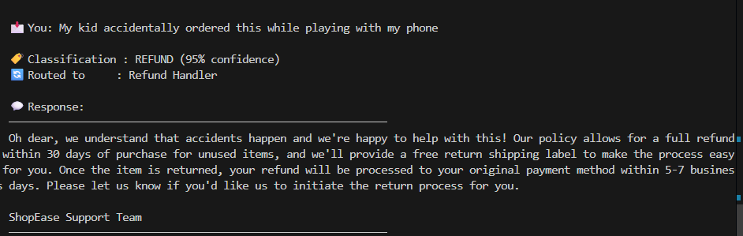
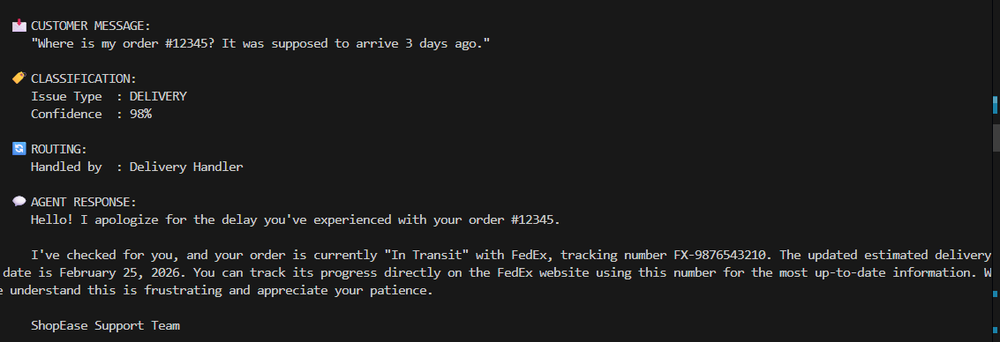
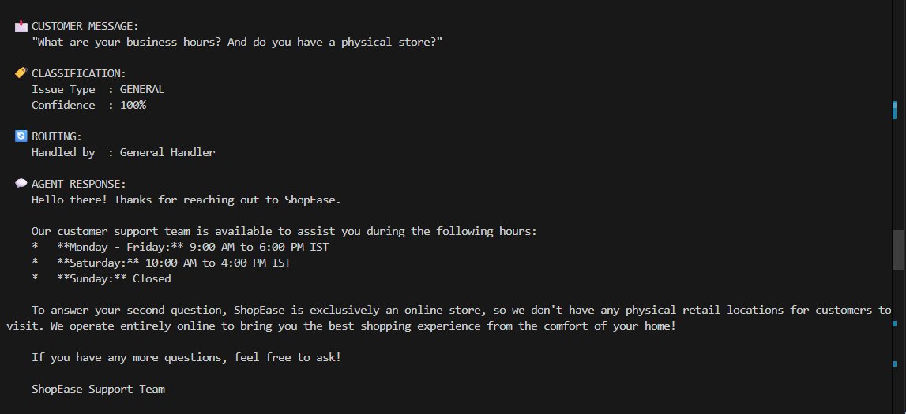

# Agentic AI Project — Development Artifacts Document

## E-Commerce Customer Support Agent

Bhavya Ahuja  
2023111035

Screenshots of demo:








## Table of Contents

1. [Use Case Definition](#1-use-case-definition)
2. [What Makes This Agentic AI](#2-what-makes-this-agentic-ai)
3. [Architecture & Design](#3-architecture--design)
4. [Steps to Build an Agentic AI Application](#4-steps-to-build-an-agentic-ai-application)
5. [Development Artifacts](#5-development-artifacts)
6. [Code Walkthrough](#6-code-walkthrough)
7. [External Services & APIs](#7-external-services--apis)
8. [Testing & Validation](#8-testing--validation)

---

## 1. Use Case Definition

### Problem Statement

Build an **AI agent for e-commerce customer support** that can autonomously handle incoming customer messages. The agent receives a text message from a customer and must:

1. **Understand** the customer's intent from their natural language message
2. **Classify** the issue type (delivery, refund, technical issue, or general inquiry)
3. **Route** the message to the correct specialized handler
4. **Generate** an appropriate, empathetic response using contextual information
5. **Escalate** to a human agent when the situation requires it (low confidence, angry/legal language)

### Business Context

E-commerce companies receive thousands of customer support messages daily. Most queries fall into predictable categories (80/20 rule). An agentic AI system can:

- **Reduce response time** from hours to seconds
- **Handle 70-80% of queries** without human intervention
- **Free up human agents** for complex, sensitive, or high-value interactions
- **Provide consistent, 24/7 support** regardless of staffing

### Why This Use Case is Suitable for Agentic AI

| Trait | How It Applies |
|-------|---------------|
| **Autonomous Decision-Making** | The agent decides the issue type and how to handle it — no human tells it which path to take |
| **Multi-Step Reasoning** | Classify → Route → Gather Context → Decide Escalation → Generate Response |
| **Tool/API Usage** | Interacts with order databases, refund systems, knowledge bases (simulated here) |
| **Conditional Branching** | Different paths for different issue types; different outcomes based on escalation check |
| **Human-in-the-Loop** | Knows when to hand off to a human — a key agentic AI trait |

---

## 2. What Makes This Agentic AI

### Traditional AI vs. Agentic AI

| Traditional AI (Chatbot) | Agentic AI (This Project) |
|--------------------------|---------------------------|
| Single LLM call → response | Multi-step graph with LLM + tools + logic |
| No routing or decision logic | Conditional routing based on classification |
| Cannot use external tools/APIs | Integrates with order DB, refund system, knowledge base |
| Always responds the same way | Adapts behavior per issue type |
| No escalation ability | Autonomously escalates when confidence is low or situation is sensitive |
| Stateless | Stateful — carries context through multiple processing steps |

### The Five Agentic Capabilities Demonstrated

1. **Perception** — Reads and understands the customer's natural language message
2. **Reasoning** — Classifies the issue type with a confidence score using an LLM
3. **Planning** — Routes to the appropriate handler and decides whether to escalate
4. **Action** — Calls simulated external APIs (order lookup, refund check, KB search)
5. **Communication** — Generates a contextual, empathetic response tailored to the issue

---

## 3. Architecture & Design

### High-Level Architecture Diagram

```
    ┌──────────────────────────────────────────────────────────┐
    │                   CUSTOMER INPUT                         │
    │            (Natural language message)                     │
    └──────────────────────┬───────────────────────────────────┘
                           │
                           ▼
                  ┌─────────────────┐
                  │   START (Entry)  │
                  └────────┬────────┘
                           │
                           ▼
              ┌─────────────────────────┐
              │     CLASSIFY ISSUE      │ ◄── LLM Call (Gemini)
              │  (issue_type + conf.)   │     Understands intent
              └────┬─────┬─────┬───┬───┘
                   │     │     │   │
        ┌──────────┘     │     │   └──────────┐
        ▼                ▼     ▼              ▼
  ┌───────────┐  ┌──────────┐ ┌───────────┐ ┌──────────┐
  │ DELIVERY  │  │  REFUND  │ │ TECHNICAL │ │ GENERAL  │
  │ HANDLER   │  │ HANDLER  │ │  HANDLER  │ │ HANDLER  │
  │           │  │          │ │           │ │          │
  │ Order DB  │  │ Payment  │ │ Knowledge │ │ FAQ DB   │
  │ API (sim) │  │ API(sim) │ │ Base(sim) │ │  (sim)   │
  └─────┬─────┘  └────┬─────┘ └─────┬─────┘ └────┬─────┘
        │              │             │             │
        └──────────────┴──────┬──────┴─────────────┘
                              │
                              ▼
                   ┌──────────────────┐
                   │ CHECK ESCALATION │ ◄── Rule-based logic
                   │ (confidence +    │     (confidence < 0.5 OR
                   │  keyword check)  │      sensitive keywords)
                   └───────┬──────────┘
                           │
                ┌──────────┴──────────┐
                │                     │
           No Escalation         Escalation
                │                     │
                ▼                     ▼
      ┌─────────────────┐   ┌──────────────────┐
      │    GENERATE      │   │   ESCALATE TO    │
      │    RESPONSE      │   │     HUMAN        │
      │  (LLM Call -     │   │  (Generate case  │
      │   Gemini)        │   │   summary +      │
      │                  │   │   handoff msg)    │
      └────────┬─────────┘   └────────┬─────────┘
               │                      │
               ▼                      ▼
           ┌──────┐              ┌──────┐
           │ END  │              │ END  │
           └──────┘              └──────┘
```

### Technology Stack

| Component | Technology | Role |
|-----------|-----------|------|
| **Orchestration** | LangGraph | Defines the agent as a stateful graph with nodes and conditional edges |
| **LLM / Inference** | Google Gemini (`gemini-2.0-flash`) | Classification and response generation |
| **LLM Framework** | LangChain (`langchain-google-genai`) | Standardized interface for LLM calls |
| **State Management** | Python TypedDict | Shared state flowing through all nodes |
| **External APIs** | Simulated (Python functions) | Order DB, Refund system, Knowledge Base, FAQ DB |
| **Configuration** | python-dotenv | Environment variable management |

### LangGraph Concepts Used

| Concept | Where Used |
|---------|-----------|
| `StateGraph` | Main graph builder in `graph.py` |
| `TypedDict` State | `CustomerSupportState` in `state.py` |
| **Nodes** | 8 node functions in `nodes.py` |
| **Normal Edges** | Handler → check_escalation, generate_response → END |
| **Conditional Edges** | classify → route_by_issue_type, check_escalation → route_escalation |
| `START` / `END` | Entry and terminal points of the graph |
| `compile()` | Finalizes the graph for execution |
| `invoke()` | Runs the graph with an initial state |

---

## 4. Steps to Build an Agentic AI Application

### Step 1: Define the Use Case & Requirements

- Identify the business process to automate
- Define input/output format (text in → text out)
- List the different paths/categories the agent must handle
- Define when human intervention is needed (escalation criteria)
- Identify external services the agent needs to interact with

### Step 2: Design the Agent Architecture (Graph)

- Map out the agent's workflow as a flowchart
- Identify each processing step → these become **nodes**
- Identify decision points → these become **conditional edges**
- Define the shared **state schema** (what data flows between nodes)
- Decide which nodes need LLM calls vs. rule-based logic vs. API calls

### Step 3: Set Up the Development Environment

```bash
# Create project directory
mkdir customer_support_agent && cd customer_support_agent

# Create and activate virtual environment
python -m venv venv
source venv/bin/activate  # Linux/Mac

# Install dependencies
pip install langgraph langchain langchain-google-genai python-dotenv

# Set up API key
echo "GOOGLE_API_KEY=your_key_here" > .env
```

### Step 4: Implement the State Schema

Define a `TypedDict` with all fields that need to flow between nodes:

```python
class CustomerSupportState(TypedDict):
    customer_message: str
    issue_type: str
    confidence: float
    handler_context: dict
    response: str
    escalate: bool
    escalation_reason: str
```

### Step 5: Implement Node Functions

Each node is a regular Python function:
- **Input:** receives the current state
- **Processing:** does its job (LLM call, API call, logic)
- **Output:** returns a dict with state updates (only fields it changes)

```python
def classify_issue(state: CustomerSupportState) -> dict:
    # Call LLM to classify
    return {"issue_type": "delivery", "confidence": 0.95}
```

### Step 6: Implement Routing Functions (Conditional Edges)

These functions receive the state and return the name of the next node:

```python
def route_by_issue_type(state) -> str:
    return f"handle_{state['issue_type']}"
```

### Step 7: Build and Compile the Graph

Wire everything together using `StateGraph`:

```python
builder = StateGraph(CustomerSupportState)
builder.add_node("classify_issue", classify_issue)
builder.add_edge(START, "classify_issue")
builder.add_conditional_edges("classify_issue", route_by_issue_type, [...])
graph = builder.compile()
```

### Step 8: Integrate External Services & APIs

In a production system, node functions would call real APIs:

| Service | API Example | Our Simulation |
|---------|------------|----------------|
| Order Management | `GET /api/orders/{id}` | Returns mock order data dict |
| Payment/Refund | `POST /api/refunds` | Returns mock refund policy |
| Knowledge Base | `GET /api/kb/search?q=...` | Keyword-based mock KB lookup |
| CRM / Customer DB | `GET /api/customers/{id}` | Returns mock FAQ data |

### Step 9: Integrate LLM / Inference APIs

| Step | Details |
|------|---------|
| **Choose a model** | Gemini 2.0 Flash (free tier via Google AI Studio) |
| **Classification call** | Structured prompt → JSON output → parse issue_type + confidence |
| **Response generation call** | Context-enriched prompt → natural language response |
| **Error handling** | Fallback values if JSON parsing fails |

### Step 10: Test, Iterate, Deploy

- Test with diverse customer messages covering all categories
- Test edge cases (ambiguous messages, multi-issue messages)
- Test escalation triggers (low confidence, sensitive keywords)
- Add logging and monitoring
- Deploy with a checkpointer for persistence (production)

---

## 5. Development Artifacts

### 5.1 Project File Structure

```
Agentic_AI/
├── .env                       # API key configuration
├── requirements.txt           # Python dependencies
├── state.py                   # State schema (TypedDict)
├── nodes.py                   # All 8 node functions
├── graph.py                   # Graph construction & compilation
├── main.py                    # Entry point & test harness
|-- test_agent.py              # Unit tests for node functions (optional)
├── README.md                  # This document
```

### 5.2 State Schema (Data Flow Contract)

| Field | Type | Set By | Description |
|-------|------|--------|-------------|
| `customer_message` | `str` | Input | Raw customer text |
| `issue_type` | `str` | `classify_issue` | Category: delivery/refund/technical/general |
| `confidence` | `float` | `classify_issue` | Classification confidence (0.0–1.0) |
| `handler_context` | `dict` | Handler nodes | Context from simulated API calls |
| `response` | `str` | `generate_response` / `escalate_to_human` | Final output text |
| `escalate` | `bool` | `check_escalation` | Whether to escalate |
| `escalation_reason` | `str` | `check_escalation` | Why escalation was triggered |

### 5.3 Node Specifications

| Node | Type | Input Fields | Output Fields | External Calls |
|------|------|-------------|---------------|----------------|
| `classify_issue` | LLM | `customer_message` | `issue_type`, `confidence` | Gemini API |
| `handle_delivery` | Tool/API | `customer_message` | `handler_context` | Order DB (sim) |
| `handle_refund` | Tool/API | `customer_message` | `handler_context` | Payment API (sim) |
| `handle_technical` | Tool/API | `customer_message` | `handler_context` | Knowledge Base (sim) |
| `handle_general` | Tool/API | — | `handler_context` | FAQ DB (sim) |
| `check_escalation` | Logic | `confidence`, `customer_message` | `escalate`, `escalation_reason` | None |
| `generate_response` | LLM | `customer_message`, `issue_type`, `handler_context` | `response` | Gemini API |
| `escalate_to_human` | Logic | `customer_message`, `issue_type`, `escalation_reason` | `response` | None |

### 5.4 Routing Logic

**Route 1: Issue Type Classification** (Conditional Edge after `classify_issue`)

| Condition | Next Node |
|-----------|-----------|
| `issue_type == "delivery"` | `handle_delivery` |
| `issue_type == "refund"` | `handle_refund` |
| `issue_type == "technical"` | `handle_technical` |
| `issue_type == "general"` | `handle_general` |

**Route 2: Escalation Check** (Conditional Edge after `check_escalation`)

| Condition | Next Node |
|-----------|-----------|
| `escalate == True` | `escalate_to_human` |
| `escalate == False` | `generate_response` |

### 5.5 Prompt Templates

**Classification Prompt:**
```
You are a customer support issue classifier for an e-commerce company.
Analyze the customer message and classify it into ONE of: delivery, refund, technical, general.
Respond with JSON: {"issue_type": "<category>", "confidence": <0.0-1.0>}
```

**Response Generation Prompt:**
```
You are a customer support agent for "ShopEase". Generate a helpful response using:
- The customer's message
- The classified issue type
- Context gathered from our systems (order data, refund policies, KB articles, etc.)
Be empathetic, concise, and provide next steps.
```

### 5.6 Escalation Rules

| Trigger | Threshold | Rationale |
|---------|-----------|-----------|
| Low classification confidence | `confidence < 0.5` | Agent is unsure — human should decide |
| Legal/threat keywords | "lawsuit", "sue", "legal", "lawyer" | Legal risk — requires human judgment |
| Manager request | "manager", "supervisor", "human agent" | Customer explicitly wants a human |
| Extreme dissatisfaction | "unacceptable", "worst experience" | High churn risk — needs personal attention |

### 5.7 Test Cases

| # | Input Message | Expected Classification | Expected Outcome |
|---|--------------|------------------------|-----------------|
| 1 | "Where is my order #12345?" | Delivery (high conf.) | Normal response with tracking info |
| 2 | "I received broken headphones. I want a refund." | Refund (high conf.) | Normal response with refund policy |
| 3 | "The app keeps crashing when I try to checkout." | Technical (high conf.) | Normal response with troubleshooting steps |
| 4 | "What are your business hours?" | General (high conf.) | Normal response with business hours |
| 5 | "I'm going to sue you! I want a manager!" | Any (may be low conf.) | **ESCALATED** — legal threat + manager request |

---

## 6. Code Walkthrough

### `state.py` — The Shared State

The state is a Python `TypedDict` that acts as the **shared memory** for the agent. Every node can read from it and write back updates. LangGraph manages the state automatically — you just return the fields you want to update.

Key design choice: Using `TypedDict` over a Pydantic model because it's simpler, has less overhead, and is recommended by LangGraph for most use cases.

### `nodes.py` — The Worker Functions

This file contains all 8 node functions. Each function:
1. Receives `state: CustomerSupportState`
2. Does its specific job
3. Returns `dict` with only the fields it updates (not the entire state)

**LLM Nodes** (`classify_issue`, `generate_response`): These call Google Gemini via `ChatGoogleGenerativeAI` from LangChain. The classification node uses a structured prompt that asks for JSON output, which is then parsed.

**Handler Nodes** (`handle_delivery`, etc.): These simulate external API calls. In a real system, you'd replace the mock data with actual HTTP requests to your order management system, payment gateway, etc.

**Logic Nodes** (`check_escalation`, `escalate_to_human`): Pure Python logic — no LLM calls. The escalation check uses a combination of confidence thresholds and keyword detection.

### `graph.py` — The Agentic Workflow

This is where LangGraph shines. The graph is built in 4 steps:
1. **Create** a `StateGraph` parameterized with the state schema
2. **Add nodes** — register each function as a named node
3. **Add edges** — wire nodes together (normal + conditional)
4. **Compile** — finalize the graph for execution

The two **conditional edges** are the key agentic features:
- `route_by_issue_type`: dynamically routes to the correct handler based on LLM classification
- `route_escalation`: decides whether to respond or escalate based on confidence + keywords

### `main.py` — The Entry Point

Loads the `.env` file, validates the API key, defines 5 test scenarios, and runs each through the compiled graph. The output is formatted for easy reading.

---

## 7. External Services & APIs

### Services Used (Simulated)

In a production agentic AI application, the handler nodes would integrate with real external services:

| Service | Purpose | Real-World API Example | Our Simulation |
|---------|---------|----------------------|----------------|
| **Order Management System** | Look up order status, tracking | Shopify Orders API, WooCommerce API | Returns mock order dict with tracking number |
| **Payment Gateway / Refund System** | Process refunds, check eligibility | Stripe Refunds API, Razorpay API | Returns mock refund policy dict |
| **Knowledge Base / Documentation** | Find troubleshooting articles | Zendesk KB API, Confluence API | Keyword-based mock article lookup |
| **CRM / Customer Database** | Retrieve customer history, preferences | Salesforce API, HubSpot API | Returns mock FAQ data |
| **Notification Service** | Alert human agents for escalation | Slack API, email, PagerDuty | Print to console |

### Model / Inference API

| Component | Details |
|-----------|---------|
| **Provider** | Google AI (Gemini) |
| **Model** | `gemini-2.0-flash` |
| **Tier** | Free (via AI Studio API key) |
| **Usage** | 2 calls per agent run: 1 for classification, 1 for response generation |
| **Integration** | Via `langchain-google-genai` package → `ChatGoogleGenerativeAI` |
| **Fallback** | If LLM output is malformed, defaults to `general` category with low confidence |

---

## 8. Testing & Validation

### How to Run

```bash
# Navigate to the project directory
cd Agentic_AI/

# Install dependencies
pip install -r requirements.txt

# Set your API key in .env
# GOOGLE_API_KEY=your_key_here

# Run the agent
python main.py
```

### Expected Output

For each test message, the agent prints:
- The original customer message
- Classification result (issue type + confidence %)
- Which handler processed it
- Whether it was escalated (and why)
- The final response (either LLM-generated or escalation message)

---